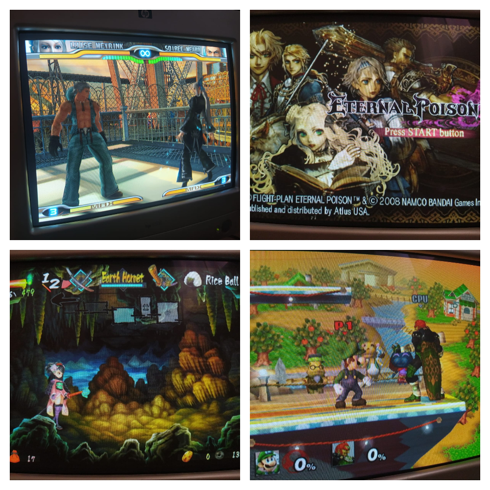

Meu setup para Wii, PS2 e jogos em 240p usando retroarch e um monitor CRT VGA.

# Conseguindo 240p verdadeiros com o retroarch

### CRU

[CRU](https://custom-resolution-utility.en.lo4d.com/windows) permite que você crie resoluções personalizadas. Usaremos essa aplicação para criar uma resolução de 1920x240.

Coloque os valores da imagem no CRU, rode o executável restart64.exe e pronto.


### Retroarch config

Agora precisamos configurar o retroarch para usar a resolução que acabamos de criar. Você pode pegar o retroarch.cfg deste repositório, ou apenas editar os campos a seguir:

```
video_fullscreen = "true"
video_windowed_fullscreen = "false"
video_fullscreen_x = "1920"
video_fullscreen_y = "240"
aspect_ratio_index = "22"
video_refresh_rate = "120.000000"
crt_switch_resolution = "3"
crt_switch_resolution_super = "1920"
menu_driver = "rgui"
```

Tenha em mente que essas configurações podem ser salvas como core overrides, case queira usar uma resolução maior para o menu principal do retroarch.

Segue os meus resultados:


### Lidando com os portáteis
Nós configuramos o retroarch para trabalhar com consoles de resolução 320x240, porém portáteis como o GBC e o GBA trabalham com resoluções menores. Se você tentar usar os emuladores deles, verá que a imagem usa a quantidade correta de linhas verticais, mas que a imagem se estica horizontalmente para ocupar a tela toda.

Considerando que estamos usando uma resolução estranha de 1920x240, nós precisamos calcular a largura correta para ter as mesmas proporções que a tela original do portátil.

Segue o método que usei para fazer os cálculos necessários, usando o GBC como exemplo:

1. Descubra as proporções da tela e a resolução do portátil em questão
    * 10:9, 160x144 para o GBC
2. Nossa resolução tem uma proporção de 8:1, então multiplique esses valores pela altura da proporção da tela do portátil
    * 9 neste exemplo, então a nossa nova proporção será 72:9
3. Divida a largura desta nova proporção pela largura da proporção da tela do portátil
    * 72/10 = 7.2
4. Pegue este valor e multiplique pela largura da resolução do portátil.
    * 7.2 * 160 = 1152

Tendo essa nova resolução calculada, criaremos um override para o core do emulador do portátil. As configurações necessárias estão a seguir, você pode também pegar o arquivo Gambatte.cfg deste repositório para usar como exemplo.

```
aspect_ratio_index = "23"
custom_viewport_height = "144"
custom_viewport_width = "1152"
```

A imagem do emulador não ocupará a tela toda, então sinta-se livre para usar overlays. 

Segue os meus resultados, usando overlays:


# Wii & PS2
O Wii e o PS2 podem ser conectados nomonitor CRT usndo um conversor de Componente para VGA. O que eu tenho me permite mudar a resolução (começando em 480p) e a proporção da imagem, além de outros ajustes de imagem.

Esse tipo de conversor pode ser encontrado no [Aliexpress](https://pt.aliexpress.com/item/1005002393774648.html?spm=a2g0o.detail.1000060.1.cc6a72a4Lg4Y9k&gps-id=pcDetailBottomMoreThisSeller&scm=1007.13339.291025.0&scm_id=1007.13339.291025.0&scm-url=1007.13339.291025.0&pvid=8be36fc2-dae1-4634-a140-6ffe1f39f0dd&_t=gps-id%3ApcDetailBottomMoreThisSeller%2Cscm-url%3A1007.13339.291025.0%2Cpvid%3A8be36fc2-dae1-4634-a140-6ffe1f39f0dd%2Ctpp_buckets%3A668%232846%238116%232002&pdp_ext_f=%7B%22sku_id%22%3A%2212000020523449551%22%2C%22sceneId%22%3A%223339%22%7D&pdp_npi=2%40dis%21BRL%21430.93%21258.55%21%21%21%21%21%402101f6b116747343014295494ed6a9%2112000020523449551%21rec&gatewayAdapt=glo2bra) (Não estou recomendando esse vendedor em particular, este é apenas o primeiro conversor que eu encontrei que parece igual ao que eu tenho)




# Nintendo 64

Eu estou trabalhando em conectar o Nintendo 64 no monitor CRT (os emuladores de N64 são péssimos, então prefiro usar o hardware original). Testes com um conversor barato de composto para VGA me deram uma imagem bem feia, então estou procurando alternativas.
