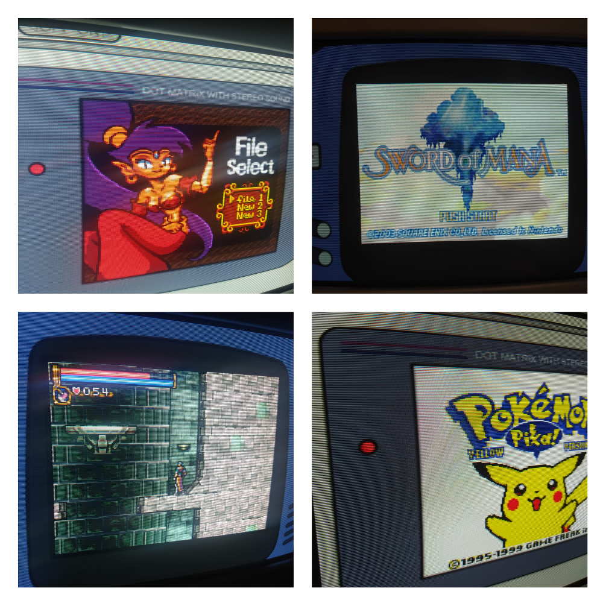

My VGA CRT gaming setup for Wii, PS2, and emulators running at 240p through retroarch.

# Getting true 240p through retroarch

### CRU

[CRU](https://custom-resolution-utility.en.lo4d.com/windows) allows you to create custom resolutions. We'll use that to add a 1920x240 resolution.

Just input these values into CRU, run restart64.exe and that's it.


### Retroarch config

Now we need to configure retroarch to be able to use that new resolution we've just created. You can grab the retroarch.cfg file from this repository, or edit the following fields on your own:

```
video_fullscreen = "true"
video_windowed_fullscreen = "false"
video_fullscreen_x = "1920"
video_fullscreen_y = "240"
aspect_ratio_index = "22"
video_refresh_rate = "120.000000"
crt_switch_resolution = "3"
crt_switch_resolution_super = "1920"
menu_driver = "rgui"
```

Mind you, these configurations can be used on core overrides if you want to have retroarch's main menu to run at a higher resolution.

Here's my results:


### Dealing with handhelds
We've set  320x240 to our main resolution, but handhelds such as the GBC and GBA work with smaller resolutions. If you just try to run their emulators without any changes to the configuration, you'll notice that the image occupies the correct vertical space, but horizontally it stretches out to the edges of the screen.

Being that we're working with super an weird 1920x240 resolution, we need to calculate the correct width so as to get the same aspect ratio as the original handheld's screen.

Here's how I've done that, using the GBC as an example:

1. Get the handheld's aspect ratio
    * 10:9 for the GBC
2. Our resolution has an aspect ratio of 8:1, so multiply that by the height of the handheld's aspect ratio
    * 9 in this example, so our new aspect ratio becomes 72:9
3. Divide our new aspect ratio's width by the handheld's aspect ratio width
    * 72/10 = 7.2
4. Get that value and multiply by the handheld's horizontal resolution
    * 7.2 * 160 = 1152

With this new resolution we'll add an override for the handheld's emulator core, so that this resolution only get's used with the correct emulator. Here's how that looks like:

```
aspect_ratio_index = "23"
custom_viewport_height = "144"
custom_viewport_width = "1152"
```

The emulator's image will not fill the entire screen, so feel free to use to use some overlays.

Here's my results:




# Wii & PS2
The Wii and PS2 can be connected to the CRT Monitor using a Component to VGA adapter. This one I've got allows you to switch between scaling resolutions (starting at 480p itself) and aspect ratios, and it also allows for picture adjustments.

You can find Component to VGA adapters on [Aliexpress](https://pt.aliexpress.com/item/1005002393774648.html?spm=a2g0o.detail.1000060.1.cc6a72a4Lg4Y9k&gps-id=pcDetailBottomMoreThisSeller&scm=1007.13339.291025.0&scm_id=1007.13339.291025.0&scm-url=1007.13339.291025.0&pvid=8be36fc2-dae1-4634-a140-6ffe1f39f0dd&_t=gps-id%3ApcDetailBottomMoreThisSeller%2Cscm-url%3A1007.13339.291025.0%2Cpvid%3A8be36fc2-dae1-4634-a140-6ffe1f39f0dd%2Ctpp_buckets%3A668%232846%238116%232002&pdp_ext_f=%7B%22sku_id%22%3A%2212000020523449551%22%2C%22sceneId%22%3A%223339%22%7D&pdp_npi=2%40dis%21BRL%21430.93%21258.55%21%21%21%21%21%402101f6b116747343014295494ed6a9%2112000020523449551%21rec&gatewayAdapt=glo2bra) (Not recommending this seller, this is just the first one I've found that looks just like the converter I have)

# Nintendo 64

I'm working on getting the Nintendo 64 connected to this setup as well (The emulators suck, so I'd rather have the original hardware if possible). I've got a composite to vga adapter and it works, but image is pretty blurry and the colors don't look very good. The N64 doesn't output component so I can't just hook it up using the same adapter I use for the Wii and PS2.

There are some HDMI adapters for the Nintendo 64, so I could use those and a HDMI to VGA adapter, but I'm afraid of ending up with a widescreen image that I can't shrink down to 4:3. Need to test.

Will update once I have this figure out.
