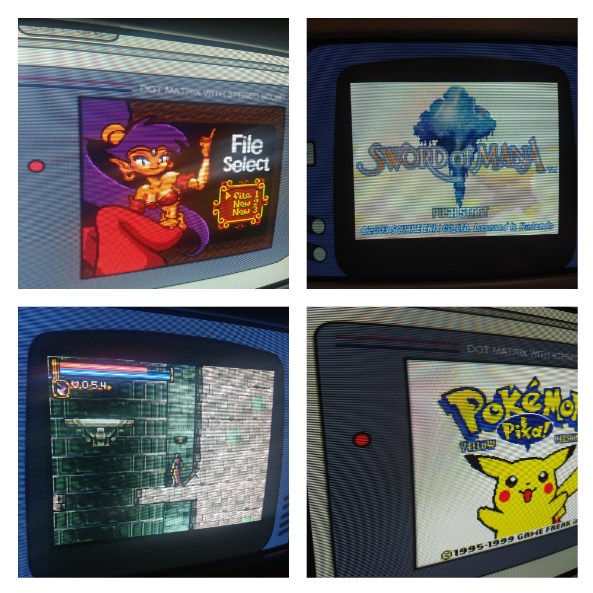

### Lidando com os portáteis
Nós configuramos o retroarch para trabalhar com consoles de resolução 320x240, porém portáteis como o GBC e o GBA trabalham com resoluções menores. Se você tentar usar os emuladores deles, verá que a imagem usa a quantidade correta de linhas verticais, mas que a imagem se estica horizontalmente para ocupar a tela toda.

Considerando que estamos usando uma resolução estranha de 1920x240, nós precisamos calcular a largura correta para ter as mesmas proporções que a tela original do portátil.

Segue o método que usei para fazer os cálculos necessários, usando o GBC como exemplo:

1. Descubra as proporções da tela e a resolução do portátil em questão
    * 10:9, 160x144 para o GBC
2. Nossa resolução tem uma proporção de 8:1, então multiplique esses valores pela altura da proporção da tela do portátil
    * 9 neste exemplo, então a nossa nova proporção será 72:9
3. Divida a largura desta nova proporção pela largura da proporção da tela do portátil
    * 72/10 = 7.2
4. Pegue este valor e multiplique pela largura da resolução do portátil.
    * 7.2 * 160 = 1152

Tendo essa nova resolução calculada, criaremos um override para o core do emulador do portátil. As configurações necessárias estão a seguir, você pode também pegar o arquivo Gambatte.cfg deste repositório para usar como exemplo.

```
aspect_ratio_index = "23"
custom_viewport_height = "144"
custom_viewport_width = "1152"
```

A imagem do emulador não ocupará a tela toda, então sinta-se livre para usar overlays. 

Segue os meus resultados, usando overlays:


